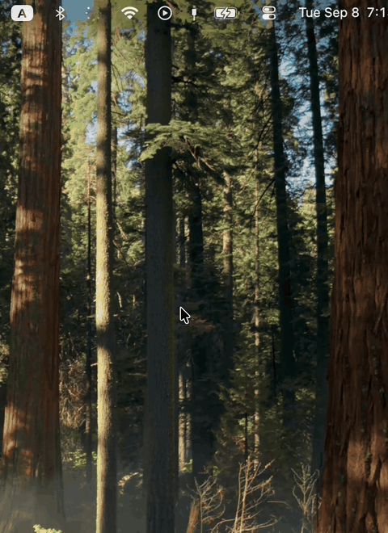

# Fast Internet Summary 

A native macOS menu-bar app for the three questions you actually ask about a connection: what am I on, is it doing anything right now, and how fast can it go?



No Dock icon. Click the plug/antenna, or press **⌥⌘.**, and a compact panel drops down on the display the mouse is on. Close it with the X or **Escape**.

## Install

macOS 15 or later.

<p>
  <a href="https://github.com/dk9966/FastInternetSummary/releases/latest/download/FastInternetSummary.dmg">
    
  </a>
</p>

Open the disk image and drag **Fast Internet Summary** onto **Applications**. Open it from Applications or Spotlight. Look for the plug/antenna in the menu bar.

The first time, macOS may say it cannot verify the developer. Close that window, Control-click the app, choose **Open**, then **Open** again. If it still blocks, System Settings → Privacy & Security → **Open Anyway**.

### From source

Xcode from the App Store (open it once to accept the license). No Homebrew, accounts, or Swift packages. Speed tests use macOS’s `networkQuality` unless you optionally install Ookla’s CLI.

```bash
git clone https://github.com/dk9966/FastInternetSummary.git
cd FastInternetSummary
bash scripts/install.sh
```

Builds a Release app, copies it to `/Applications` (or `~/Applications` if needed), and opens it.

```bash
PREFIX="$HOME/Applications" bash scripts/install.sh   # install elsewhere
bash scripts/package-dmg.sh                            # dist/FastInternetSummary.dmg
open FastInternetSummary.xcodeproj                     # work on the code
```

Select the **FastInternetSummary** scheme and run (⌘R).

## Uninstall

Quit from Settings, or Control-/right-click the menu-bar icon. Turn off Launch at Login first if it is on (in the app, or System Settings → General → Login Items). Drag **Fast Internet Summary** from Applications to the Trash.

```bash
rm -rf /Applications/FastInternetSummary.app ~/Applications/FastInternetSummary.app
defaults delete com.danielku.FastInternetSummary   # optional; settings are local
```

## What it shows

Three blocks:

**Connection** — Ethernet, Wi‑Fi, or both. If both are up, **In use** is the one carrying internet traffic. Wi‑Fi shows the network name when macOS will give it; Ethernet shows negotiated link speed when available.

**Live activity** — byte counters on the default-route interface, about once a second. Near zero when nothing is transferring, even on a fast plan. That is expected. This is not a speed test.

**Speed test** — capacity. The title is the engine: **MacOS Network Quality** by default, or **Ookla Speedtest** from Settings. Opening the panel starts one. If the path in use changes while the panel is open (ethernet unplugged, Wi‑Fi takes over), a new test starts on the new path. Idle latency (**ms** on the right) lands almost immediately; download and upload then run one after the other and update live. Ping under each speed is latency while that direction is filling the line.

A progress bar and stage line sit under the numbers: idle latency, then download, then upload. The last complete result stays on the Mac, with a **Checked … ago** line. A new test keeps those numbers faded until fresh samples replace them.

Settings can switch to Ookla’s official CLI if installed — same engine as the Speedtest app. **Download and upload together** is Apple-only; those results can differ from Speedtest. Run again to repeat. Closing the panel cancels a test in progress.

Do not mix the last two numbers. Live activity is traffic right now. The speed test is what the line can do under load.

## Using it

| Action        | How                                                        |
| ------------- | ---------------------------------------------------------- |
| Open / toggle | Click the menu-bar icon, or **⌥⌘.**                        |
| Close         | X button, **Escape**, or **⌥⌘.** again                     |
| Settings      | Gear next to the title                                     |
| Quit          | Settings, or Control-click / right-click the menu-bar icon |

Settings: launch at login, live rates in the menu bar, sample interval (1s / 2s / 5s), optional Speedtest CLI, simultaneous vs sequential Apple tests, and the global shortcut. Default is **⌥⌘.** — not a system shortcut, and you can change it.

## How the numbers are measured

Live rates come from `getifaddrs` byte counters on the active interface.

Default speed test is `/usr/bin/networkQuality`. Idle latency is Apple’s `base_rtt`: a few quiet-line probes before the line is saturated. Capacity is sequential by default (`-s`); Settings can run download and upload at once. Verbose TTY output is parsed so Mbps updates live. Loaded ping is Apple’s downlink/uplink responsiveness, in milliseconds.

If **Use Speedtest (Ookla)** is on, the app runs `speedtest --format=jsonl` against a nearby server (remembered ~30 minutes so the next test can skip the hunt). JSONL is parsed so idle ping, download, upload, and loaded ping update live. The CLI is optional. Launches are capped so we do not trip Ookla’s rate limit.

```bash
brew tap teamookla/speedtest
brew install speedtest
```

## Notes

- **In use** is the default route, not whichever looks faster.
- Ethernet link speed is omitted when the negotiated media rate cannot be read.
- Wi‑Fi name comes from CoreWLAN. Some macOS versions hide the SSID without Location permission; this app does not ask, so it still shows connected / in-use without a name.
- No Accessibility or Screen Recording permission. The shortcut uses `RegisterEventHotKey`.
- Agent app (`LSUIElement`): no Dock bounce.
- Multi-display: the panel opens on the mouse’s display; it does not follow the icon between screens.
- No account, analytics, or own servers. Connection names, live rates, and the last result stay on the Mac. Apple’s `networkQuality` talks to Apple; the optional CLI talks to Ookla.

## License

MIT. See [LICENSE](LICENSE).
